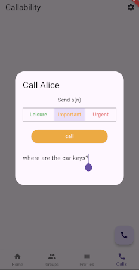
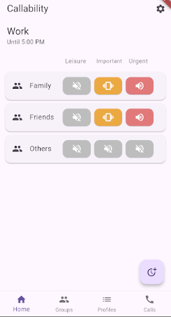

# Callability

Metadata-enriched calling: 

  - the caller sets a priority when initiating a call, and an optional subject:

    

  - color-coded priority and subject are visible to the receiver of the call:

Additionally, the receiver can filter calls based on contact, urgency and a schedule:

The three available priorities are:

  - Leisure: _I want to talk, but if you're not available that's ok_
  - Important: _I have to talk to you about this **today**, but if you can't right this minute then later is ok_
  - Urgent: _I have to talk to you about this **right now**_

## Roadmap / Limitations

The following features are on the roadmap but not yet implemented:

  - iOS support: currently Android only
  - voip: currently call accept/reject is communicated to receiver, but no voip session is started - there is no call and no audio is transmitted
    - on Android, switch to a foreground service 
  - add support for apple-id and phone-number auth: currently only google sign in is supported

## Project architecture

The client app is written in Dart/Flutter, the server in Python. Client-server communication
is via grpc and push notifications

## Client-server communication

A client initiates a call by connecting to the server over GRPC and sending the identifier(s) 
of the recipient. The server authenticates the request using firebase auth and sends a call 
initiation request via push notification to the client, which then connects back to the server
using GRPC to send an ACK and subsequently an optional ACCEPT or REJECT. 

The server will relay the recipient's ACK and optional ACCEPT or REJECT to the calling device 
(over GRPC). If no response is received within a fixed timeframe, the server sends both the 
caller and the recipient a HANGUP message (the former over GRPC, the latter via a push 
notification).

### Client architecture

#### Layout

    ├── lib
    │    ├── main.dart
    │    ├── app.dart                # root widget
    │    ├── objectbox.g.dart        # generated object-box classes
    │    ├── objectbox-model.json    # object-box schema
    │    ├── routes.dart
    │    ├── dependencies.dart       # widget that provides dependencies from the controller
    │    ├── logging.dart
    │    ├── protobuf                # generated protobuf classes
    │    └── src
    │    ├── blocs
    │    │   ├── app_init            # state, cubit and widgets for each component
    │    │   ├── ...
    │    │   └── schedules
    │    ├── controller      
    │    │   ├── app_init.dart       # initializes the "controller"
    │    │   └── controller.dart     # centralizes cubits and repositories
    │    ├── model                   # object-box models and various data classes/enums
    │    ├── pages                   # page widgets, utilizes widgets from the blocs/ package
    │    ├── repositories
    │    ├── storage                 # storage abstraction over db
    │    └── utils 
    └── pubspec.yaml 

#### Generators (objectbox and protobuf)

The object-box model classes can be generated with:

    dart run build_runner build

The protobuf classes can be generated using:

    protoc -I=../server/protobuf --dart_out=grpc:./lib/protobuf ../server/protobuf/service.proto

### Server architecture

The server is written in Python. It listens to incoming grpc connections and uses Firebase for 
server-side storage (realtime-database), auth (Google sign in) and push notifications (Firebase 
cloud messaging).

#### Running the server locally

    poetry install
    poetry run grpc-server --port 50051

#### Layout

    ├── callability_server
    │   ├── call_worker.py            # call initiation and lifetime handler
    │   ├── check_health.py           # test client script for verifying server is online
    │   ├── firebase_utils.py         # misc firebase utilities
    │   ├── main.py                   # parse CLI arguments, start the server
    │   ├── message_board.py          # pub/sub
    │   ├── response_worker.py        # handles responses from receiver (ACK/ACCEPT/REJECT)
    │   └── server.py                 # grpc server, hands requests offf to the workers
    └── protobuf
        ├── service_pb2_*.py          # protobuf bindings
        └── service.proto             # protobuf schema

#### Generators (protobuf)

To generate the python protobuf classes:

    poetry run python -m grpc_tools.protoc -Iprotobuf/ --python_out=protobuf --grpc_python_out=protobuf protobuf/service.proto --pyi_out=protobuf
